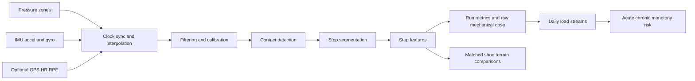
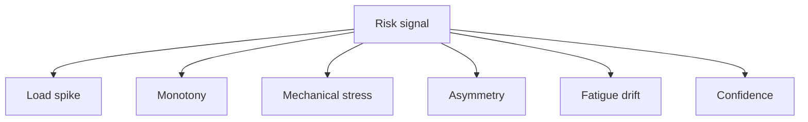
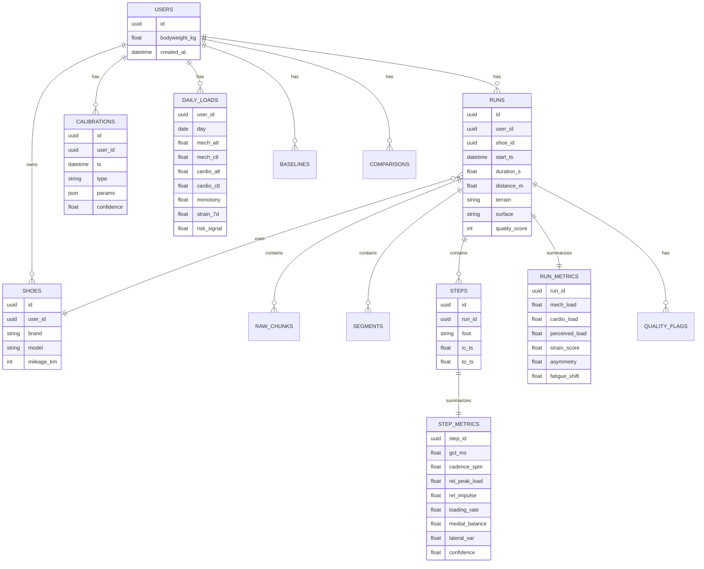

# SubStride training strain injury risk and environment comparison system

## Executive summary

This report follows the SubStride research brief in the uploaded project file fileciteturn0file0 and synthesizes official product documentation, vendor white papers, and primary or near-primary biomechanics sources into an implementation-oriented system design. The main conclusion is that the best commercial systems fall into three families: cardio-centric load systems built on TRIMP or EPOC-style physiology; fitness-fatigue trend systems built on 7-day and 28-to-42-day rolling or exponentially weighted loads; and gait-form systems that expose stride, impact, pronation, and asymmetry metrics. The strongest design choice for SubStride is to **combine all three**, but to let **mechanical foot load** be the primary differentiator because direct plantar pressure plus IMU data can measure stresses that HR-only and power-only systems cannot localize. citeturn67view0turn68view1turn7view1turn22view3turn23view3turn25view0turn28view0turn69view1turn70view0

Existing systems provide a clear blueprint. Garmin/Firstbeat builds training effect and load around EPOC-derived physiology; TrainingPeaks, Strava, Runalyze, and Stryd all use a fitness-fatigue logic with short and long windows; Polar is especially relevant because it splits load into **cardio**, **muscle**, and **perceived** domains; Stryd adds running-specific stress and a 42-day versus 7-day balance; RunScribe and NURVV expose shoe-, terrain-, and strike-related gait metrics. At the same time, each of these systems has an important limitation for SubStride’s use case: cardio-only systems miss local mechanical fatigue, Stryd explicitly notes that its RSS does **not** account for surface differences, and the more form-focused products generally do not integrate gait mechanics into a full longitudinal strain-and-risk model. citeturn67view0turn25view0turn23view3turn28view0turn53view0turn58news0

The recommended SubStride architecture is a **multi-axis load model** with three parallel streams: **Mechanical Load**, **Cardio Load**, and **Perceived Load**, where Mechanical Load is computed directly from step-level pressure and IMU signals, Cardio Load uses TRIMP-like logic when HR is present, and Perceived Load uses session RPE × duration when the user supplies it. These streams should be aggregated daily and trended with EWMA acute and chronic loads, monotony, and a conservative “risk signal” rather than a medical injury prediction. This recommendation borrows Polar’s multi-load framing, TrainingPeaks/Runalyze/Stryd’s acute-chronic trend logic, and Firstbeat’s emphasis on physiology, while improving them with localized plantar-force features and fair environment comparison. citeturn23view3turn23view0turn23view2turn7view1turn70view1turn71view0turn28view0turn67view0

The most important product opportunity is the **environment, terrain, and shoe comparison engine**. SubStride should not compare raw run averages across unlike runs. Speed materially affects tibial strain and mechanical loading, and Stryd itself says trail surface differences can make effort higher than RSS records. The right solution is a layered comparison framework: matched pace-cadence-grade bins for MVP, mixed-effects regression for v2, and personalized counterfactual models for research-grade comparisons. That lets SubStride answer questions competitors struggle with, such as: “Which shoe reduces my loading rate at the same effective pace?” or “Does this trail increase lateral instability after controlling for speed and cadence?” citeturn40academia2turn25view0turn53view0

Finally, the report’s practical recommendation is to launch with metrics that the hardware can support accurately and explain clearly: step count, cadence, ground contact time, contact asymmetry, regional impulse maps, impact load, medial/lateral balance, session strain, weekly mechanical load, and matched-condition shoe or terrain comparisons. High-risk outputs such as absolute injury probability, exact vGRF, braking force, or leg stiffness should remain behind confidence gates until lab validation is complete. That sequencing matches the state of the public evidence: gait-event timing and smart-insole force estimation can be very good, but force reconstruction quality still depends heavily on calibration, sensor stability, and model choice. citeturn61academia1turn61academia3turn54academia1turn74academia2

## Existing systems and scientific evidence

### Platform comparison

The table below focuses on what is public, what is proprietary, and what SubStride should borrow.

| Platform | Main load or strain concept | Public inputs | Public windows | Formula status | Strengths | Weaknesses | What SubStride should borrow and improve | Sources |
|---|---|---|---|---|---|---|---|---|
| Garmin with Firstbeat | Training Effect, Training Load, Training Status, Acute Load | HR-derived physiology, VO2 context, workout duration, VO2max trend | Garmin publicly describes acute-load style summaries; Firstbeat EPOC is session-level | **Partly public**. Firstbeat publishes HR-based EPOC logic, but Garmin production formulas are proprietary | Very strong coaching narrative; physiology-based rather than just duration × intensity | EPOC mainly reflects aerobic recovery demand and can underrepresent local muscular fatigue; production details are opaque | Borrow the session narrative and “productive vs overreaching” framing, but add direct mechanical foot stress | citeturn67view0turn68view1turn12news1turn10news0 |
| TrainingPeaks | TSS, ATL, CTL, TSB | Power, pace, HR, duration, threshold values | ATL 7 days, CTL 42 days | **Mostly public** in concept; exact score variants depend on modality | Excellent long-term load trending and coach familiarity | Threshold-dependent; sensitive to bad FTP or threshold estimates; cardio-heavy unless external power exists | Borrow the acute-chronic charting, but do it separately for mechanical, cardio, and perceived load | citeturn7view1turn25view0 |
| Strava | Relative Effort, Fitness, Fatigue, Form | Power and duration and or HR plus Perceived Exertion | Impulse-response style; shorter fatigue and longer fitness trends | **Proprietary implementation, public conceptual model** | Accessible trend UX; simple story for subscribers | Depends on good FTP or HR/RPE data; limited gait specificity | Borrow the trend UX and “training story” language, but make the underlying driver foot-level mechanics | citeturn22view0turn22view1turn22view3 |
| Polar | Training Load Pro with Cardio Load, Muscle Load, Perceived Load | HR, power, duration, RPE | 28-day tolerance baseline; strain-to-tolerance ratio; 90-day session context for verbal scales | **Public at high level** | Best commercial framing for multi-domain load; explicitly separates cardio, musculoskeletal, and subjective load | Muscle load still depends on running power rather than direct plantar measurements | Borrow the three-load architecture, but replace inferred muscle load with direct pressure-and-IMU mechanical load | citeturn23view3turn23view1turn23view2turn23view0 |
| Stryd | RSS and RSB | Running power and critical power | 42-day long-term and 7-day short-term weighted averages | **Partly public**. RSS functional form is public, with hidden constants | Running-specific stress; critical-power anchored; clear readiness balance | Surface differences are not accommodated; still not localized; depends on CP quality | Borrow CP-anchored stress and 42/7 trend balance, but add surface, shoe, and regional-load correction | citeturn25view0turn28view0turn29view0 |
| Runalyze | TRIMP, ATL, CTL, AC ratio, monotony, training strain | HR reserve, duration, daily TRIMP | ATL 7 days, CTL 42 days, monotony last 7 days | **Public** in glossary form | Transparent formulas; good for power users; monotony and strain are explicit | HR-only by default; thresholds are generic; less consumer-friendly | Borrow transparency and monotony/strain math, but expose it with stronger biomechanics and cleaner UX | citeturn69view1turn69view2turn70view0turn70view1turn71view0turn71view1 |
| WHOOP | Daily Strain, Recovery, Sleep | Sleep, HRV, resting HR, respiratory rate, all-day physiology | Daily recovery and daily strain views | **Mostly proprietary** | Very effective, simple daily UX and behavior-change framing | Weak mechanical specificity for runners; formula detail is sparse in public sources reviewed | Borrow the daily readiness UX, but explain mechanical drivers instead of only giving a black-box score | citeturn65search0turn65news2turn65news3 |
| RunScribe | Pace, cadence, contact time, shock, impact and braking Gs, pronation metrics, footstrike type | Foot-mounted IMU, pace, community comparison at matched pace | Per-run plus matched-pace comparisons | **Public metric definitions; proprietary implementation details** | Strong shoe, terrain, pronation, and shock interpretation; explicitly pace-matched community comparison | Does not provide a full acute-chronic training-risk stack | Borrow matched-pace comparison logic and shoe/terrain interpretations; improve with pressure maps and longitudinal risk | citeturn53view0 |
| NURVV | Pressure-based cadence, pronation, foot strike, pace, step length | Pressure sensors plus motion sensing | Per-run analytics | **Product behavior public, formula details not public** | Pressure-sensor product precedent; consumer-friendly gait metrics | Limited published detail on longitudinal training load | Borrow experience design for pressure-derived gait metrics, but integrate them into trend and comparison systems | citeturn58news0 |
| Plantiga | Public technical detail sparse in sources reviewed | Likely gait and performance monitoring | Not enough public detail in reviewed sources | **Insufficient public formula detail located** | Relevant benchmark for field gait monitoring | Not enough public technical transparency in reviewed sources | Track as a competitive benchmark, but do not infer formulas without direct documentation |  |
| Arion | Public technical detail sparse in sources reviewed | Smart insole running analysis positioning | Not enough public detail in reviewed sources | **Insufficient public formula detail located** | Relevant benchmark for sensorized insole UX | Not enough public technical transparency in reviewed sources | Track as a UX and market benchmark, but do not infer algorithms without direct documentation |  |

### What the empirical literature supports

The strongest public physiology foundation is the Firstbeat EPOC model. In its white paper, Firstbeat describes HR-based EPOC estimation as a function of previous EPOC, current intensity, and elapsed time, built from meta-analysis across 48 exercise settings and 158 subjects with durations from 2 to 180 minutes and intensities from 18% to 108% of VO2max. In their validation summary, HR-based EPOC correlated with measured EPOC with an \(r^2\) of 0.79. That is useful for **cardiorespiratory load** estimation, but Firstbeat also explicitly states that EPOC mainly reflects aerobic properties and may not optimally reflect local muscular fatigue or acidity-driven exhaustion. That limitation is exactly why SubStride should not make cardio-derived strain the primary load signal. citeturn67view0turn68view0turn68view1

Commercial trend systems converge around the same conceptual architecture. TrainingPeaks describes TSS as the root workout “load” from which ATL and CTL are derived, with ATL using the last 7 days and CTL using the last 42 days. Strava says its Fitness and Freshness tool uses Training Load and or Relative Effort in an impulse-response model based on Banister and Coggan; Fitness is accumulated load, Fatigue uses a shorter timescale, and Form is the difference between the two. Stryd defines RSB as the difference between a 42-day weighted average and a 7-day weighted average. Runalyze also exposes ATL as a 7-day EWMA of TRIMP and CTL as a 42-day EWMA of TRIMP. The public evidence therefore strongly supports using **short-term and long-term rolling load states**, but it does **not** imply that one single load dimension is enough. citeturn7view1turn22view3turn28view0turn70view1turn71view0

Polar provides the clearest public support for a multi-axis load model. Training Load Pro separates **Cardio Load** from **Muscle Load** and **Perceived Load**. Cardio Load is TRIMP based, Muscle Load is mechanical energy from power multiplied by duration, and Perceived Load is RPE × duration. Polar also requires time to establish a personal baseline and uses a 28-day average load window for tolerance and a strain-to-tolerance ratio for status feedback. For SubStride, the key insight is that this three-part model is already a proven UX structure. The improvement is straightforward: replace Polar’s **inferred Muscle Load** with a **direct foot-mechanical load** from pressure and IMU. citeturn23view3turn23view1turn23view2turn23view0

The public evidence on monotony and ACWR is more mixed and should be treated carefully. Runalyze exposes both monotony and training strain explicitly, and its glossary defines monotony from variation in day-level TRIMP and training strain as a combination of monotony and cumulative TRIMP. But recent methodological critiques argue that ACWR can be misleading when treated as a universal injury threshold, because ratio construction, averaging method, tapering behavior, sparse data, confounding, and selection bias all matter. The safest product decision is to use ACWR-like features and monotony as **one set of risk signals**, not as a sole injury predictor or as a claim that risk increases at one universal threshold. citeturn70view0turn69view1turn71view1turn42academia1turn41academia4

The biomechanics literature and commercial gait tools strongly support using direct foot signals for load and movement quality. RunScribe publicly defines cadence, contact time, impact and braking Gs, shock, pronation excursion, pronation velocity, and footstrike type, and it repeatedly emphasizes that pace, footwear, and terrain dramatically change these values. It also compares several of its metrics against a community database at the **same pace**, which is exactly the right comparative logic. NURVV similarly shows that pressure-sensor insoles can expose cadence, pronation, step length, and foot strike to consumers. This means SubStride can plausibly outperform cardio-centric tools by building an accurate, direct measurement layer for **regional stress**, **asymmetry**, **fatigue drift**, and **shoe or surface effects**. citeturn53view0turn58news0

The force-estimation literature is promising but still calibration-sensitive. Recent smart-insole studies show that pressure plus IMU data can estimate vGRF-related signals with very strong correlations under controlled conditions, and structured ML models can estimate gait events and stance time from wearable accelerometry with low millisecond error. At the same time, the best reported results are usually from controlled protocols rather than every real outdoor run, so any SubStride force output should be confidence-scored and calibration-tiered rather than presented as indisputable ground truth. citeturn61academia3turn61academia1turn54academia1turn74academia2

## SubStride measurement stack and data model

### Core design principles

SubStride should treat **raw mechanical dose** as the product’s irreplaceable asset. Everything else in the stack should be designed around preserving that signal rather than over-compressing it too early. In practice, that means storing raw and lightly processed data, step-level features, run-level aggregates, and rolling longitudinal states separately. It also means storing **raw dose** independently from any **0–100 user score**, because the score may change as your models evolve while the raw dose remains reusable. This is the single best way to future-proof the product.

The stack should also be explicitly **multi-tiered**. Many users will not have HR, GPS, or bodyweight on every run. The system therefore needs an MVP mode that produces reliable relative mechanical metrics from pressure and IMU alone, a calibrated mode that estimates bodyweight-normalized force proxies when standing calibration and bodyweight are available, and a research-grade mode that uses user-specific or population-trained force-estimation models validated against force plates. Smart-insole literature and the Apple Watch vGRF dataset both support this tiered mindset: useful biomechanics are possible with wearable data, but quality depends heavily on how synchronized, calibrated, and context-rich the data are. citeturn61academia3turn62academia5turn74academia2

### Sensor fusion and foundational metric accuracy

The recommended processing order is below.



For production use, the software should aim for **pressure sampling of at least 100 Hz and preferably 200 Hz**, with IMU sampling of **200 Hz preferred and 100 Hz minimum**. Those are engineering targets, not claims about vendor behavior; they give enough temporal resolution for GCT, loading-rate approximations, and toe-off timing while keeping battery and BLE throughput manageable. The Apple Watch vGRF dataset shows that 100 Hz IMU data can still support useful force-estimation research when synchronized against 1000 Hz force-plate ground truth, but foot-mounted signals from insoles justify a higher preferred rate. citeturn62academia5

Recommended preprocessing for MVP is:

- Zero-offset correction per pressure channel before each run.
- Standing calibration if available, ideally 5 to 10 seconds of quiet bilateral stance.
- Pressure low-pass filter around 20 to 30 Hz for summary metrics, with a parallel higher-band path for loading-rate estimation if signal quality supports it.
- IMU gravity separation or orientation-aware fusion for vertical and fore-aft axes.
- Clock-drift checks and cross-correlation refinement between pressure onset and IMU impacts.
- Contact detection using pressure first, IMU second, and a fused fallback when pressure quality drops.

The preferred contact logic is pressure-led because SubStride’s footwear position gives a direct ground-contact signal:

\[
P_\Sigma(t) = \sum_{i=1}^{Z} w_i\,p_i(t)
\]

where \(p_i(t)\) is pressure in zone \(i\), and \(w_i\) is the zone calibration weight. Initial contact is the first sample where \(P_\Sigma(t)\) exceeds a dynamic threshold for at least \(n\) consecutive frames. Toe-off is the first sample after stance where \(P_\Sigma(t)\) returns below threshold. If pressure quality is low, toe-off and contact can be refined with vertical acceleration and angular-rate patterns, consistent with the gait-event estimation literature. citeturn61academia1turn61academia3

### Data dictionary

The minimum viable SubStride data dictionary should be split across raw, step-level, run-level, and longitudinal states.

#### Raw data

| Category | Fields |
|---|---|
| Pressure stream | timestamp, left or right foot, zone id, raw pressure count, temperature if available, saturation flag |
| IMU stream | timestamp, foot side, accel xyz, gyro xyz, sensor temperature, packet loss count |
| Optional GPS | timestamp, lat, lon, altitude, speed, grade estimate, heading |
| Optional HR | timestamp, HR bpm, RR interval if available, source confidence |
| User context | bodyweight, shoe id, terrain label, route id, surface label, perceived effort, injury-note flag |

#### Step-level features

| Category | Fields |
|---|---|
| Timing | initial contact, toe-off, GCT, step time, flight time if estimable, cadence |
| Pressure magnitude | peak total pressure, pressure impulse, early-stance peak, late-stance peak |
| Regional distribution | heel impulse, midfoot impulse, medial forefoot impulse, lateral forefoot impulse, hallux impulse, arch contact ratio |
| Center of pressure | initial CoP zone, terminal CoP zone, CoP path length, heel-to-forefoot transfer time |
| IMU-derived | footstrike angle proxy, vertical impact acceleration, fore-aft braking proxy, inversion/eversion angular velocity proxy |
| Symmetry | left-right differences for GCT, peak load, impulse, regional distribution |
| Quality | missing samples, saturation fraction, sync confidence, segmentation confidence |

#### Run-level aggregates

| Category | Fields |
|---|---|
| Volume | duration, distance if available, steps, mean cadence, pace, elevation and grade summaries |
| Mechanical | raw mechanical dose, dose per minute, dose per km, dose per 1000 steps, peak-load percentile, loading-rate percentile |
| Form and fatigue | asymmetry index, fatigue shift index, medial-lateral balance drift, contact-time drift at matched pace |
| Territory-specific | shoe-conditioned metrics, terrain-conditioned metrics, surface variability index, route stability index |
| Composite scores | run strain score, cardio load, perceived load, data-quality score, confidence tier |

#### Longitudinal states

| Category | Fields |
|---|---|
| Daily load | daily mechanical load, daily cardio load, daily perceived load |
| Rolling | ATL mechanical, CTL mechanical, ATL cardio, CTL cardio, monotony, training strain, TSB-like balance |
| Personalized baselines | 30-day and 60-day matched-pace baselines per metric, per shoe, per route, per terrain |
| Comparison model outputs | shoe effect estimate, terrain effect estimate, confidence interval, matched-overlap score |
| Risk model | load-spike subscore, monotony subscore, mechanical subscore, asymmetry subscore, fatigue-drift subscore, final risk signal, confidence |

### Force estimation tiers

A realistic SubStride force strategy should explicitly separate what is being estimated.

| Tier | What you estimate | Recommended method | What to show users |
|---|---|---|---|
| MVP relative | Relative peak load, relative impulse, loading-rate proxy, impact concentration | Standing-normalized pressure sum plus IMU refinement | “Impact load,” “regional stress,” “mechanical strain,” “stress balance by foot zone” |
| Calibrated | Approximate bodyweight-normalized vGRF proxy and impulse | User standing calibration plus zone gains plus IMU fusion | “Estimated peak load,” “estimated impulse,” stronger shoe and terrain comparisons |
| Research-grade | Personalized vGRF waveform, loading rate, stiffness, braking and propulsion proxies | Population or user-specific ML model trained against force-plate ground truth | Advanced metrics behind confidence rating and validation badge |

A practical set of formulas is:

\[
\hat F_{press}^{rel}(t) = \frac{\sum_i w_i p_i(t)}{\operatorname{median}(P_{\Sigma,\;stand})}
\]

\[
\hat F_z(t) = \lambda(t)\,\hat F_{press}(t) + \big(1-\lambda(t)\big)\,\hat F_{imu}(t)
\]

where \(\lambda(t)\) is a dynamic confidence weight that rises during stable contact and falls when pressure saturation, drift, or packet loss make the pressure estimate less trustworthy. Research work on smart-insoles shows that multimodal fusion outperforms pressure-only approaches, but the product should never hide the calibration tier from the user. citeturn61academia3turn54academia1turn74academia2

## Algorithms for session strain rolling load and injury-risk

### Single-run strain design

The cleanest SubStride session model is to compute **three separate session loads** and then fuse them:

- **Mechanical Session Load**
- **Cardio Session Load**
- **Perceived Session Load**

This mirrors Polar conceptually, but SubStride’s mechanical stream is much richer because it comes from direct plantar measurement instead of inferred running power. citeturn23view3turn23view1turn23view2

#### Mechanical session load

For each step \(s\), compute a step cost:

\[
C_s = \alpha_1 I_s + \alpha_2 P_s + \alpha_3 LR_s + \alpha_4 B_s + \alpha_5 V_s + \alpha_6 A_s
\]

where:

- \(I_s\) = relative impulse over stance
- \(P_s\) = peak relative load
- \(LR_s\) = loading-rate proxy in early stance
- \(B_s\) = braking proxy from fore-aft IMU plus early heel loading
- \(V_s\) = instability or variability proxy such as CoP path dispersion or mediolateral acceleration
- \(A_s\) = asymmetry penalty when left-right difference exceeds the user’s normal band

Then aggregate:

\[
ML_{run} = \sum_{s=1}^{N} C_s
\]

and derive contextualized normalizations:

\[
ML_{per\;min} = \frac{ML_{run}}{\text{duration}_{min}}, \quad
ML_{per\;km} = \frac{ML_{run}}{\text{distance}_{km}}, \quad
ML_{per\;1000\;steps} = \frac{1000\,ML_{run}}{N}
\]

SubStride should store **all four** values. The raw run dose is best for longitudinal modeling. Per-minute, per-km, and per-step versions are best for fair comparisons and UX.

#### Cardio session load

If HR is present, use a TRIMP-like model. Public vendor sources consistently use duration plus individualized intensity. Runalyze describes TRIMP as HR reserve and duration, and Polar uses TRIMP for Cardio Load. citeturn69view2turn23view3

A practical SubStride cardio formula is:

\[
CL_{run} = \sum_t f\big(HR_{reserve}(t)\big)\,\Delta t
\]

where \(f\) is a convex weighting so harder intensities contribute disproportionately more load than easy running.

#### Perceived session load

If session RPE exists, use:

\[
PL_{run} = RPE \times duration_{min}
\]

This is directly aligned with Polar’s public Perceived Load definition. citeturn23view2

#### Session strain score

The public systems suggest that multi-axis framing is easier to interpret than one giant black-box number. I recommend:

\[
Load_{fused} =
w_m\,z(ML_{run}) + w_c\,z(CL_{run}) + w_p\,z(PL_{run})
\]

with default weights:

- \(w_m = 0.65\)
- \(w_c = 0.25\)
- \(w_p = 0.10\)

when all streams are present, and automatic reweighting when one or more streams are missing.

Then convert to a user-facing 0–100 score with a saturating transform against the athlete’s recent baseline:

\[
Strain_{run} = 100\left(1 - e^{-Load_{fused}/S_u}\right)
\]

where \(S_u\) is a user-specific scale term estimated from the last 30 to 60 days of valid runs.

That produces an intuitive score but preserves a raw underlying dose for serious analysis.

#### Example

An illustrative easy-road run might look like this:

- 50 min
- 8,900 steps
- median cadence 178 spm
- median GCT 246 ms
- moderate peak-load percentile
- low asymmetry
- low fatigue drift

If the fused dose lands slightly above the user’s recent easy-run baseline, the run might score **Strain 58**.

A slower but technical trail run in a worn shoe might produce:

- lower pace
- similar duration
- higher step-to-step variability
- higher lateral load variance
- higher loading-rate spikes on descents
- larger late-run fatigue drift

That run could reasonably score **Strain 71**, even if pace is slower, because the normalized mechanical cost is higher. This is exactly the kind of comparison cardio-only systems and surface-agnostic running-power systems struggle to capture. citeturn25view0turn53view0

### Rolling load and time-series model

The public market consensus is to maintain both a short-term and a long-term state. TrainingPeaks, Stryd, and Runalyze all point to roughly **7-day acute** and **42-day chronic** models, while Polar builds tolerance from a **28-day average daily load**. The best SubStride design is to maintain all three parallel streams using EWMAs, with 7-day acute and 42-day chronic as defaults for mechanical load, and a 28-day tolerance view for user-facing explanations. citeturn7view1turn28view0turn70view1turn71view0turn23view0

For daily load \(L_t\):

\[
ATL_t = k_a L_t + (1-k_a)ATL_{t-1}
\]

\[
CTL_t = k_c L_t + (1-k_c)CTL_{t-1}
\]

with:

\[
k_a = 1 - e^{-1/7}, \qquad k_c = 1 - e^{-1/42}
\]

A form or balance measure is:

\[
TSB_t = CTL_t - ATL_t
\]

SubStride should maintain this separately for mechanical and cardio streams instead of collapsing everything into one line.

#### Cold start

Because Polar, Stryd, and Runalyze all warn that early baselines are unstable, SubStride should stage confidence as follows:

- **First week:** session-only metrics, no injury-risk signal
- **Weeks two through four:** provisional acute load and early monotony
- **Weeks five and six:** provisional chronic load and comparison baselines
- **After day forty-two:** full rolling-load confidence

That avoids false certainty and matches public vendor behavior. citeturn23view0turn28view0turn71view0

#### Pseudocode

```python
def update_daily_loads(user_id, day, mech_load, cardio_load=None, perceived_load=None):
    prev = load_daily_state(user_id, day - 1)
    ka = 1 - math.exp(-1/7)
    kc = 1 - math.exp(-1/42)

    state = {}
    for key, value in {
        "mech": mech_load,
        "cardio": cardio_load or 0.0,
        "perceived": perceived_load or 0.0,
    }.items():
        atl_prev = prev.get(f"{key}_atl", 0.0)
        ctl_prev = prev.get(f"{key}_ctl", 0.0)
        atl = ka * value + (1 - ka) * atl_prev
        ctl = kc * value + (1 - kc) * ctl_prev
        state[f"{key}_atl"] = atl
        state[f"{key}_ctl"] = ctl
        state[f"{key}_tsb"] = ctl - atl

    save_daily_state(user_id, day, state)
    return state
```

### Monotony training strain and risk signal

Runalyze’s public glossary is helpful here because it explicitly exposes monotony and training strain, and its updated monotony formula avoids the blow-up that older formulations can cause when day-to-day variation is tiny. citeturn70view0turn69view1

A good bounded monotony metric for SubStride is:

\[
Monotony_{7d} = \frac{\operatorname{mean}(L_{1:7})}
{\operatorname{mean}(L_{1:7}) + \operatorname{sd}(L_{1:7})}
\]

with weekly training strain:

\[
TrainingStrain_{7d} = \left(\sum_{d=1}^{7}L_d\right)\times Monotony_{7d}
\]

Recommended SubStride defaults:

- **Monotony < 0.55**: flexible week
- **0.55 to 0.65**: moderate sameness
- **> 0.65**: high sameness and recovery concern

Those are **product defaults**, not universal clinical truths. Public Runalyze guidance places warning and critical thresholds near 0.6 and 0.67 in its updated transformed scale. citeturn70view0

### Injury-risk model

SubStride should not claim to diagnose injury or to predict an absolute injury probability from wearable data alone. The safest and most useful output is a **0–100 risk signal** with transparent subscores and a confidence band.

Recommended structure:

\[
RiskRaw =
0.30\,Spike +
0.15\,Monotony +
0.25\,Mechanical +
0.10\,Asymmetry +
0.10\,FatigueDrift +
0.10\,RecoveryContext
\]

Each component is scaled from 0 to 1.

#### Subscores

**Load spike**

Use uncoupled acute versus chronic mechanical load as the main spike signal:

\[
Spike = \sigma\left(\frac{ATL_{mech}/CTL_{mech} - 1.15}{0.15}\right)
\]

where \(\sigma\) is a logistic transform and the default centering near 1.15 reflects a cautious middle ground between “productive” and “watch” states rather than a hard injury threshold. Public sources consistently cluster around similar ranges, but those ranges should remain advisory, not diagnostic. citeturn23view0turn71view1turn28view0

**Monotony**

Use the 7-day monotony score above.

**Mechanical hazard**

Combine matched-context peaks and drift:

- loading-rate percentile versus recent baseline
- peak load percentile versus recent baseline
- instability variance
- impact concentration
- disproportionate forefoot or medial loading

**Asymmetry**

Compute persistent bilateral divergence, not one-step noise:

\[
Asym = \operatorname{mean}\left(
\frac{|x_L - x_R|}{(x_L + x_R)/2 + \epsilon}
\right)
\]

over a rolling set of recent valid runs.

**Fatigue drift**

Compare early-run and late-run metrics within matched pace, cadence, and grade bins:

\[
FatigueDrift = z(\Delta GCT) + z(\Delta LoadRate) + z(\Delta LateralVar)
\]

This is one of SubStride’s best proprietary opportunities because pressure and IMU together can see *where* fatigue manifests, not just that heart rate drifted.

**Recovery context**

Optional. If HR, HRV, sleep, or RPE context exists, use it as a soft modifier rather than a primary driver.

#### Confidence-adjusted final score

\[
Risk_{final} = 50 + Confidence \times (100\,RiskRaw - 50)
\]

This shrinks low-confidence outputs back toward uncertainty instead of pretending precision.

#### Recommended wording

Avoid “You are likely to get injured.”  
Prefer:

- “Elevated load-spike signal”
- “Higher-than-usual mechanical stress pattern”
- “Monitor recovery and consider reducing impact exposure”
- “Confidence low because calibration or sensor quality was limited”

That wording is both safer and better UX.

## Environment shoe and terrain comparison with user-facing metrics

### A fair-comparison framework

SubStride’s comparison engine is where the product can become genuinely better than today’s mainstream load tools.

The scientific reason is simple: pace and effective mechanical demand matter. Public evidence indicates that speed meaningfully changes tibial strain, and commercial gait tools like RunScribe already note that pace dramatically changes efficiency and shock. Stryd goes further and explicitly states that RSS does not accommodate surface differences, especially on sandy or rocky trails. That means a naive “run average in shoe A versus shoe B” comparison will routinely mislead users. citeturn40academia2turn53view0turn25view0

#### MVP comparison method

Use matched bins with only overlapping contexts.

For each step, assign a context bin such as:

- effective pace band
- cadence band
- grade band
- fatigue segment within run
- optional HR or RPE band

Then compare only steps that exist in overlapping bins for both conditions.

\[
Effect_{shoe} = \sum_b w_b \left(\bar y_{A,b} - \bar y_{B,b}\right)
\]

where \(w_b\) is based on the amount of mutually observed exposure in bin \(b\).

This is simple, explainable, and very strong for launch.

#### Regression-adjusted method

For v2:

\[
y_{step} = \beta_0 + \beta_1 Shoe + \beta_2 Terrain + \beta_3 Speed +
\beta_4 Speed^2 + \beta_5 Cadence + \beta_6 Grade +
\beta_7 FatigueSegment + u_{user} + u_{user,Speed} + \epsilon
\]

This lets you estimate the likely effect of a shoe or terrain while controlling for confounds and repeated measurements within the same runner.

#### Personalized model

For research-grade comparisons, learn the user’s own expected biomechanics under a reference condition, then quantify residuals under an alternative condition:

\[
Residual = y_{observed} - \hat y_{baseline\_model}
\]

This is powerful because many important running mechanics are highly individual. Strava itself warns that fitness numbers are relative to the athlete, not comparable across people, and the same is true for many biomechanical signals. citeturn22view2

#### Minimum sample rules

Recommended product defaults:

- at least **3 runs per condition**
- at least **500 matched steps per condition**
- at least **20% overlap** in effective pace-cadence-grade exposure
- bootstrap confidence interval across runs, then across steps
- hide comparisons when overlap is poor

These are engineering defaults, not claims of scientific universality.

#### Example user output

“Compared at matched effective pace and cadence, Shoe B reduced your loading-rate proxy by **8%** and lateral-load variability by **5%**, while increasing contact time by **2%**. Confidence: **moderate**, based on 1,860 matched steps across 4 runs.”

That is much more honest and useful than “Shoe B is better.”

### Unique metrics SubStride can own

The best user-facing statistics are the ones that are both interpretable and hard for competitors to replicate without pressure insoles.

| Metric | Definition | Why it matters | Launch status |
|---|---|---|---|
| Regional stress map | Per-zone impulse and peak-load distribution across heel, midfoot, medial forefoot, lateral forefoot, hallux, arch | Shows *where* load is occurring, not just how much | Launch |
| Impact concentration | Fraction of early-stance load concentrated in initial-contact zones | Useful for shoe and surface comparisons | Launch |
| Medial-lateral load balance | Medial load divided by total forefoot and midfoot load | Good for shoe, camber, and fatigue effects | Launch |
| Heel-to-toe transfer time | Time from first rearfoot loading to forefoot-dominant propulsion | Sensitive to footstrike style and terrain response | Launch |
| Propulsive toe index | Hallux and forefoot late-stance impulse share | Useful for propulsion and shoe-compliance comparisons | Launch |
| Bilateral contact asymmetry | Left-right GCT difference normalized by mean | Easy to understand and often stable | Launch |
| Fatigue shift index | Matched-context change from early to late run in GCT, load rate, and regional loading | High product differentiation | Launch |
| Surface variability index | Step-to-step variance in CoP path and lateral loading | Captures unstable terrain | Launch |
| Estimated peak vGRF | Bodyweight-normalized peak force estimate | Valuable but calibration dependent | v2 gated |
| Estimated loading rate | Early-stance force rise rate estimate | Important but must be validated carefully | v2 gated |
| Leg stiffness proxy | Function of contact time, flight time, and estimated peak force | Popular but easy to overstate | Research gated |
| Braking and propulsion force proxies | AP force estimates from IMU plus pressure timing | Useful, but difficult to validate outdoors | Research gated |

A concise evidence summary for foot regions is appropriate:

- **Rearfoot and heel**: most relevant to impact concentration and early loading patterns, with plausible links to transient shock exposure. Evidence is biomechanically strong for measuring the pattern, but direct injury prediction is limited. citeturn53view0
- **Forefoot and hallux**: most relevant to push-off and local propulsive demand, with plausible links to calf, Achilles, and metatarsal stress. RunScribe’s public guidance that forefoot-strike runners tend toward different injury distributions is useful as a heuristic, not a diagnosis. citeturn53view0
- **Medial arch and medial forefoot**: most relevant to pronation-associated loading and plantar-fascia style stress patterns, but evidence for direct injury labeling should be presented conservatively. citeturn53view0turn74search5
- **Lateral forefoot**: especially useful for cambered roads, unstable terrain, and shoe-effect comparisons where lateral variability rises. The strongest evidence here is for detecting change, not diagnosing pathology.

### Dashboard and UX recommendations

#### Post-run page

The post-run screen should have five blocks:

1. **Session Strain**  
   One large 0–100 score with confidence and a short explanation.

2. **Mechanical drivers**  
   “Higher than usual because loading rate, lateral variability, and fatigue drift were elevated.”

3. **Pressure heatmap**  
   Left and right foot region maps with toggle for peak and impulse.

4. **Symmetry and timing**  
   Cadence, GCT, bilateral asymmetry, step count.

5. **Comparison chip**  
   “Compared with your road-run baseline in this shoe: impact load +6%, confidence moderate.”

#### Weekly page

Borrow the best parts of TrainingPeaks, Strava, Polar, and Runalyze, but separate streams:

- Mechanical ATL and CTL
- Cardio ATL and CTL
- Weekly monotony
- Weekly training strain
- Shoe-wise and terrain-wise exposures
- A “what changed this week” explanation panel

#### Risk page

Use transparent subscores, not a single scary banner.



Recommended copy:

- “Your risk signal is elevated mainly because recent mechanical load rose faster than your baseline and late-run fatigue drift increased.”
- “This is not a diagnosis. Use it as a training-management cue.”

#### Comparison page

The comparison page should become a signature SubStride feature:

- tabs for **Shoes**, **Terrain**, **Routes**, **Surfaces**
- a visible **Fair comparison badge** showing overlap and confidence
- a metric switcher between raw, normalized, and matched-context effects
- quick verdicts such as “Less impact concentrated at heel,” “More stable laterally,” or “No meaningful difference detected”

## Validation implementation and launch plan

### Validation plan

SubStride should validate in four layers.

#### Lab validation

Use force plates or instrumented treadmills as ground truth for:

- initial contact and toe-off timing
- step count
- cadence
- GCT
- peak vGRF
- impulse
- loading-rate estimate

Recent smart-insole research shows that strong vGRF estimation is possible in controlled walking settings, and wearable accelerometry can estimate stance time with low millisecond error in running. These are encouraging targets, but SubStride should validate specifically in running and with its own hardware stack. citeturn61academia3turn61academia1

Recommended internal targets:

- Step detection F1: **> 0.99**
- Cadence MAE: **< 1 spm**
- GCT MAE: **< 10 ms**
- Sync offset after correction: **< 5 ms**
- Relative peak-load repeatability ICC: **> 0.85**
- Estimated peak vGRF NRMSE: **< 10% BW** for calibrated models in controlled running before public rollout

#### Repeatability validation

Collect repeat runs in:

- same shoe, same treadmill pace
- same shoe, outdoor flat route
- different shoes, same route and pace band

Evaluate coefficient of variation and ICC for the main metrics you intend to expose.

#### Field validation

Run a beta across:

- road
- trail
- treadmill
- track
- cambered roads
- downhill and uphill

The question is not only “Is the metric accurate?” but “Does it remain stable enough to support fair comparisons?”

#### False-positive and false-negative review

Every “elevated risk signal” should be reviewable against:

- data-quality flags
- recent training changes
- route changes
- shoe changes
- user notes about soreness or pain

Do not optimize only for correlation. Optimize for **trust**.

### Database and processing spec



#### Processing pseudocode

```python
def process_run(run, user):
    streams = synchronize(run.pressure, run.imu, run.gps, run.hr)
    calib = select_best_calibration(user, run.start_ts)
    filtered = preprocess(streams, calib)

    quality = compute_quality(filtered, calib)
    contacts = detect_contacts(filtered, quality)
    steps = []

    for c in contacts:
        feat = extract_step_features(filtered, c, user, quality)
        steps.append(feat)

    run_mech = aggregate_mechanical_load(steps, user.baselines)
    run_cardio = compute_cardio_load(run.hr, user) if run.hr else None
    run_perceived = run.rpe * run.duration_min if run.rpe else None

    strain = fuse_loads(run_mech, run_cardio, run_perceived, user.baselines, quality)
    fatigue = compute_fatigue_shift(steps, run.context_bins)
    asym = compute_run_asymmetry(steps)

    save_steps(run.id, steps)
    save_run_metrics(run.id, run_mech, run_cardio, run_perceived, strain, fatigue, asym, quality)
    update_daily_loads(user.id, run.day, run_mech, run_cardio, run_perceived)
```

```python
def compare_conditions(user_id, condition_a, condition_b, metric):
    steps_a = load_steps(user_id, condition_a)
    steps_b = load_steps(user_id, condition_b)

    matched_a, matched_b, overlap = matched_context_bins(
        steps_a, steps_b, keys=["effective_pace", "cadence", "grade", "fatigue_segment"]
    )

    if overlap < 0.20 or len(matched_a) < 500 or len(matched_b) < 500:
        return {"status": "insufficient_overlap"}

    effect = weighted_bin_difference(matched_a, matched_b, metric)
    ci = bootstrap_runs_and_steps(matched_a, matched_b, metric)
    confidence = comparison_confidence(overlap, ci, matched_a, matched_b)

    return {"effect": effect, "ci": ci, "confidence": confidence}
```

### MVP v2 and research rollout

| Stage | Show at launch | Hide until later |
|---|---|---|
| MVP | Step count, cadence, GCT, contact asymmetry, regional stress map, impact load, medial-lateral balance, session strain, weekly mechanical load, monotony, matched shoe and terrain comparisons with overlap badges | Estimated vGRF, exact braking force, leg stiffness, pronation velocity, absolute injury probability |
| v2 | Estimated peak load, estimated impulse, improved fatigue drift, route and terrain-normalized comparisons, shoe deterioration effects | Full force waveform, propulsion force, personalized injury forecasting |
| Research-grade | Personalized force model, advanced stiffness and braking-propulsion metrics, tailored counterfactual compare engine | Any medical-claim output without regulatory and clinical support |

The gating principle is simple: **if a metric is hard to validate and easy to overinterpret, do not launch it as a headline number**.

## Open questions and limitations

Some product details for Garmin, WHOOP, Plantiga, and Arion remain proprietary or were not exposed clearly in the public sources reviewed, so those entries are necessarily higher level than TrainingPeaks, Polar, Stryd, Runalyze, or RunScribe. citeturn65search0turn67view0turn23view3turn25view0turn69view1turn53view0

The public evidence supports built-from-load risk signaling, but not a single universal injury threshold. ACWR, monotony, and even loading-rate literature are sensitive to modeling choices, context, and the outcome being studied. SubStride should therefore present **risk as a coaching signal**, not a diagnosis. citeturn42academia1turn41academia4

The highest technical risk is not the score math. It is **foundational metric accuracy**: synchronization, step segmentation, pressure drift, temperature effects, bodyweight calibration, and sensor saturation. If those are weak, the downstream analytics will look sophisticated but will not be trustworthy. The right implementation strategy is to treat accuracy, quality scoring, and confidence estimation as first-class product features rather than back-office details. citeturn61academia3turn49academia7turn58academia1